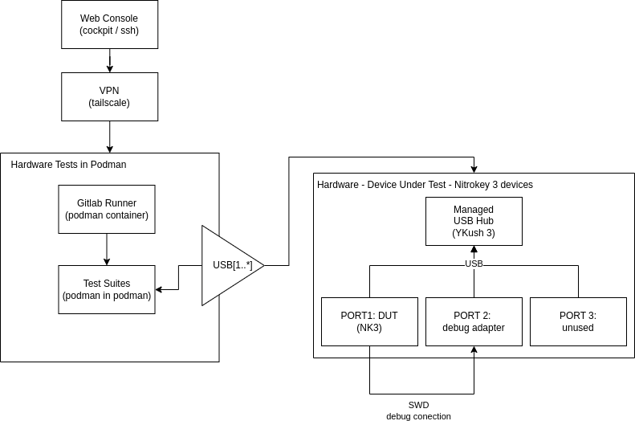

# Hardware Setup

## Host
The PC setup to run this project should contain a Linux Fedora installation. For external access a configured tailscale network and cockpit system package are recommended.

### Hardware Bill of Materials
- 1x PC machine

For each Device Under Test:
- 1x YKush 3 USB Hub
- 1x USB extension cords (optional; for better cables/devices organization)
- LPC55 setup:
  - 1x Nitrokey 3A NFC or Nitrokey 3C NFC
  - 1x NXP LPC-Link 2
  - 1x ADAFRUIT SWD breakout
- NRF52 setup:
  - 1x Nitrokey 3A Mini 
  - 1x Nordic NRF52840-DK
  - 1x NK3A Mini Production Header

## Devices Under Test
The Devices Under Test (DUT) are connected via a YKush 3 Managed USB Hub. This way the hil can selectively turn on and off each device for testing.
Each DUT has is connected directly and via the corresponding debugging board.
Configuration for each of the NK3 chip types can be found in the specific hardware configuration documentation:

- [LPC55](./hardware/lpc55_setup.md)
- [NRF52](./hardware/nrf52_setup.md)

