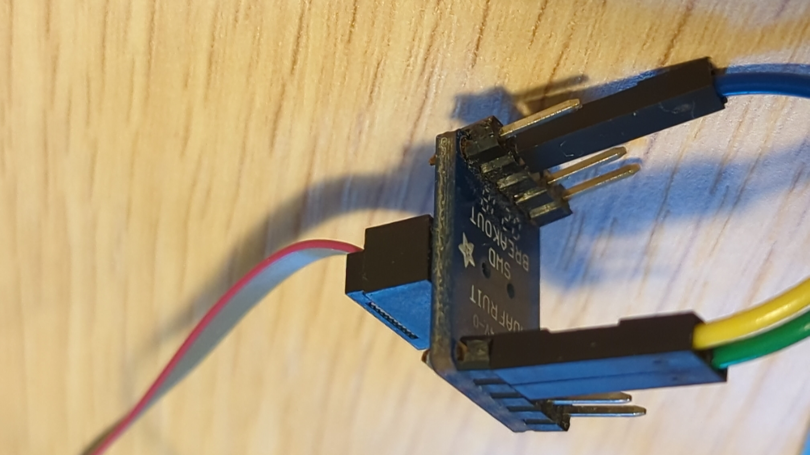
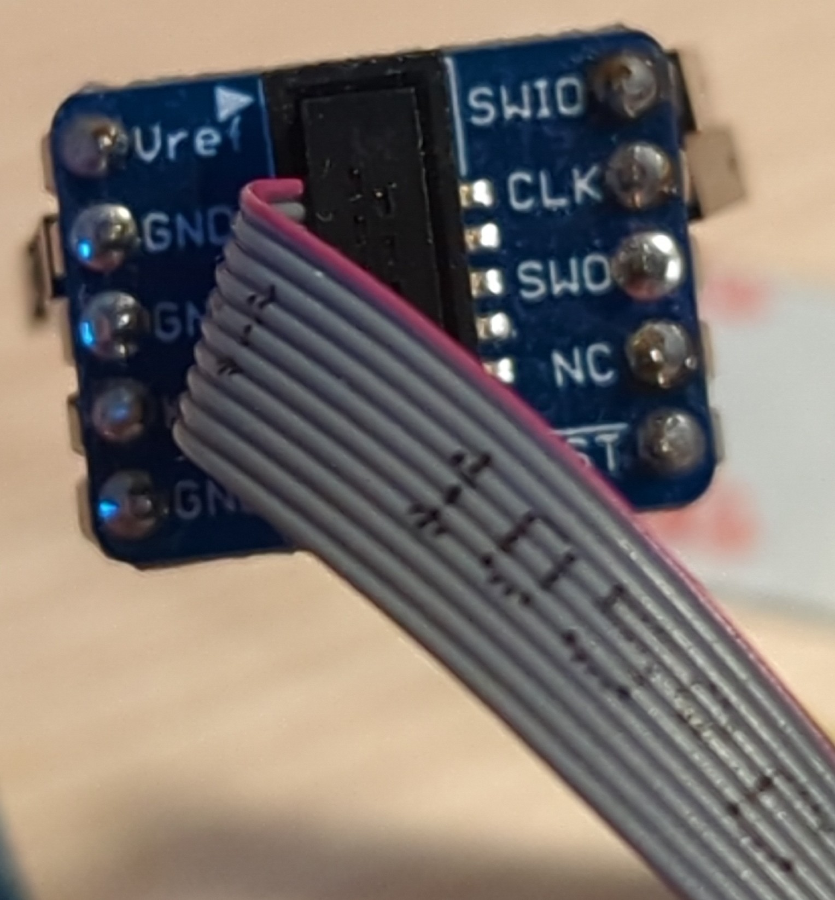
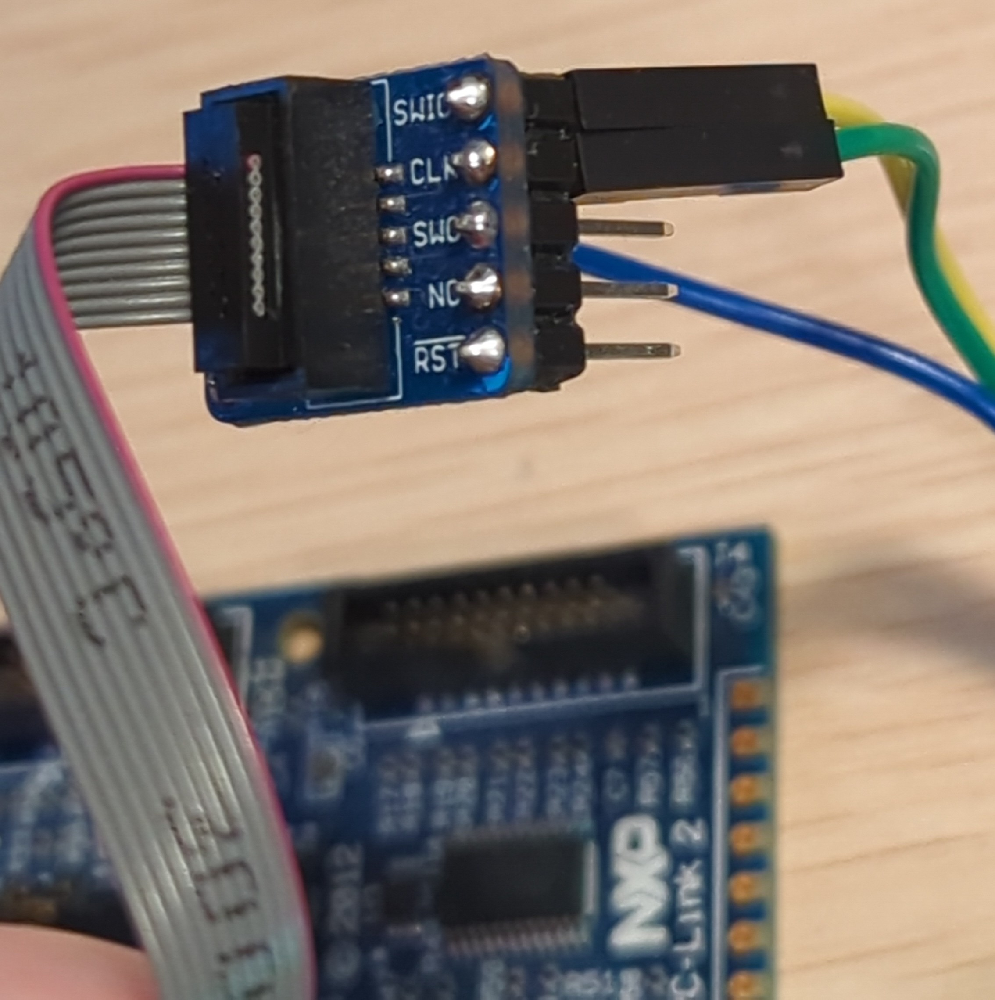
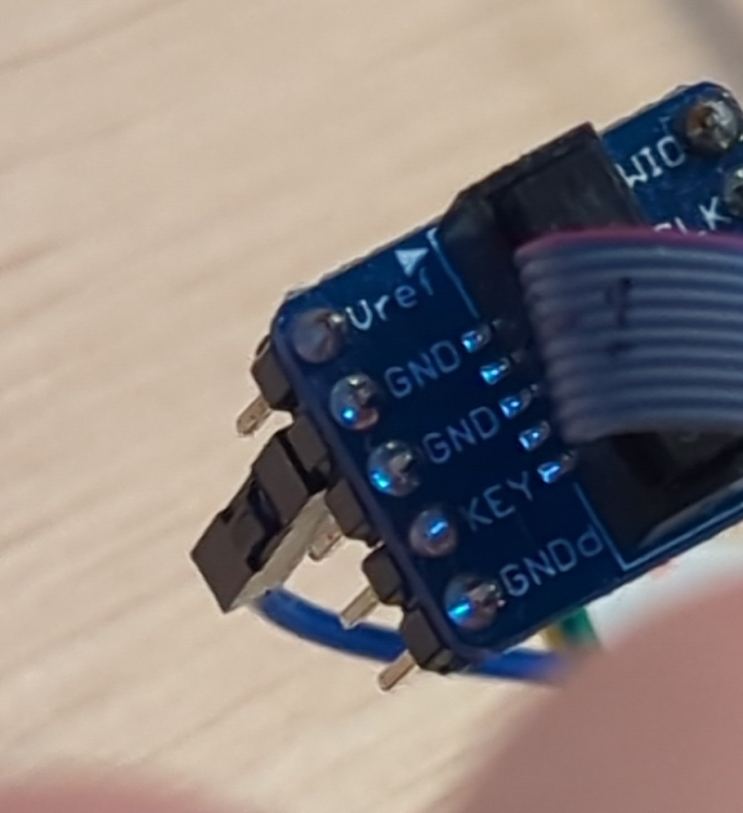
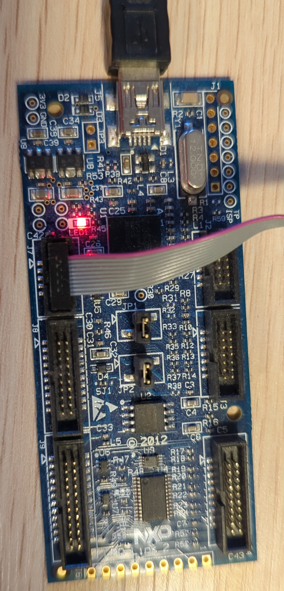

# LPC55 Hardware Setup
## Device Preparation
The LPC55 device under test should be prepared manually:

1. Initializing it with an empty configuration for the bootloader with enabled debug support
    - `lpc55 configure factory-settings CONFIG`
    - `lpc55 configure customer-settings CONFIG`
2. Additionally, PRINCE and keystore should be set up too 
    - lpc55 provision keystore.toml
3. The LPC debug adapter should be prepared to contain the JLINK firmware, as mentioned in the documentation here:
    - https://github.com/Nitrokey/nitrokey-3-firmware/blob/main/docs/lpc55-quickstart.md#j-link

Bootloader configuration is not changed during the execution of the tests
(there is no plan to add automatic configuration either).

Example configurations can be found here:
- [factory-settings config](./example-config/cfpa.toml)
- [customer-settings config](./example-config/cmpa-develop.toml)
- [keystore.toml](./example-config/keystore.toml)

The tool `lpc55` can be found here:
- [lpc55-host](https://github.com/lpc55/lpc55-host)

## Connecting device and debugger
The LPC55 device must be connected to the debugger:
1. Solder the cables:

2. Connect to debug board:

3. Connect to rest of setup:

