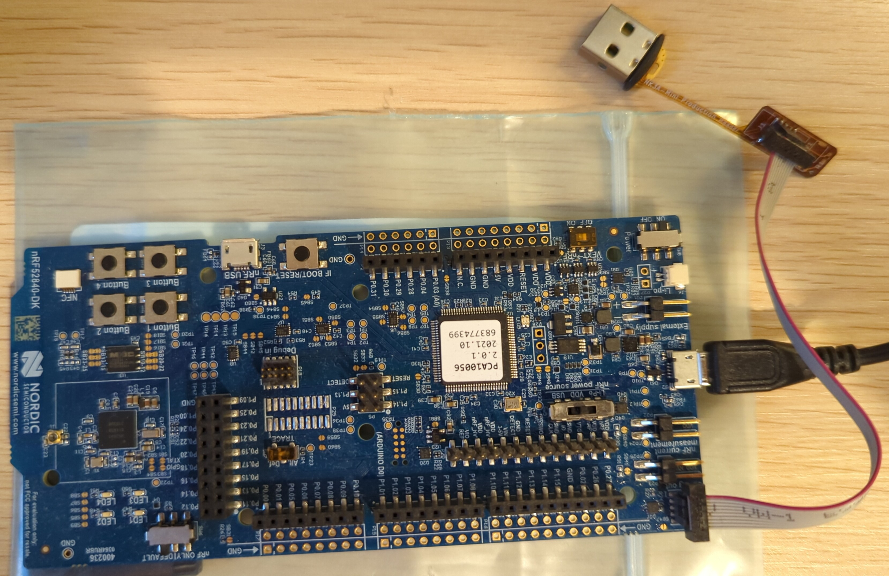

# NRF52 Hardware Setup
There are no configuration requirements for the NRF52 Device Under Test setup.

## Connecting device and debugger
1. Connect NRF52 device to the debugger:

2. Connect to rest of setup:

